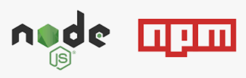

# MIT MUB - README.md

****

- 목차 소개에 앞서 저희의 조이름과 컨셉을 말씀드리겠습니다.
  
  - MIT MUB = 소통 가능한 movie hub + git hub 느낌으로 git hub 컨셉을 잡아보았습니다.

- 팀원 정보 및 업무 분담 내역
  
  - 팀장 : 김나연, 팀원 : 하진우
  
  - 김나연 : back-end, front-end, 하진우 : front-end

- 목표 서비스 구현 및 실제 구현 정도
  
  - 기본적인 요구사항은 모두 구현하였고, UI UX에 신경을 많이 쓰다보니 부가적인 기능 중 구현하지 못한 부분이 일부 있음.
  
  - **시간상** 구현하지 못한 기능들
    
    - 사용자 친화적인 영화 추천 로직 ( 잠재요인 기반 추천 시스템 )
    
    - 영화와 관련된 일정을 기록하는 플래너 기능
    
    - 유저 상호간 영화 추천 기능
    
    - 소셜로그인
    
    - 다중 필터링

****

목차

1. ERD

2. 사용한 기술 스택

3. 페이지 정보

4. 소감

****

## 1. ERD

****

## 2. 사용한 기술 스택 ! 👾

**언어** : 파이썬, css, 자바스크립트 

      

**프레임 워크** : vuejs, django

  

**기타 소프트웨어** : 노드js, npm

****

## 3. 페이지 정보 ! 🍀

0. 추천 로직
   
   
   
   - 추천 로직은 기본적으로 인기순, 상영 예정작, 킬링 타임순, 평점순, 최신순으로 나누었습니다. django에서 필터링을 한 값을 vue에서 요청 및 처리해주었습니다.

1. 로그인 회원가입 및 인트로
   
   
   
   - 로그인 페이지입니다. 회원가입을 진행하면 즉시 로그인 처리가 완료되며 인트로 페이지로 넘어가게 됩니다.

2. 검색
   
   
   
   - 우선 메인페이지는 owl carousel을 이용한 캐러셀 기능과 검색 기능 등으로 구현이 되어있습니다.
   
   - 검색 페이지에서 나오는 영화 포스터를 누르면 디테일 페이지로 이동하게 됩니다.
   
   - 물론 캐러셀 내의 포스터를 눌러도 디테일 페이지로 이동할 수 있습니다.

3. 디테일
   
   
   
   - 디테일 페이지에서 Pick this movie 버튼을 누르면 내 WatchList에 내용이 담기게 됩니다. 이 때 WatchList를 누르면 해당 영화의 디테일 페이지로 이동하게 됩니다.
   
   - 또한 줄거리보기 버튼으로 해당 영화의 줄거리를 볼 수도 있으며, 리뷰 쓰러가기 버튼을 통해 리뷰를 작성하러 이동할 수도 있습니다.

4. 리뷰, 리뷰디테일
   
   
fd-c12b-48be-b1a2-4562b146e899.gif)
   
   - 커뮤니티 기능에서는 나 이외의 다른 사용자에 대한 정보를 볼 수 있습니다. 해당 이용자들은 임의의 랜덤한 값을 통해 나타나게 됩니다.

6. 프로필 디테일
   
   
   
   - 상대 유저의 WatchList가 마음에 든다면 해당 영화를 눌러 해당 영화의 디테일로 이동 할 수 있습니다.
   
   - 프로필 디테일을 통해 상대 유저에 대한 팔로잉 등의 상호작용을 할 수 있습니다.

---

## 4. 느낀 점

### 🍣진우

- 우선 그간 싸피에서 배웠던 것을 쏟아부을 수 있는 좋은 기회였다고 생각합니다.

- 또한 배웠던 점들 뿐만 아니라 다른 새로운 것들을 많이 익힐 수 있는 좋은 기회였습니다. 여러 npm 모듈들 등 새로운 것들 등등.

- bootstrap이 쉽고 편리하게 기능을 제공해주지만 제한하는 것 또한 많다는 것을 알게되었고, CSS를 좀 더 열심히 해야겠다고 생각하게 되었습니다.

- 끝으로 막히는 부분들을 좀 더 자유롭게 구현할 수 있는 프론트 엔드 개발자가 되자는 결심을 하게되었습니다!

### 🍓나연

- 초반에 술술 풀리길래 계획을 방대하게 세웠지만, 생각보다 중간중간 막히는 부분이 많았어서 구상한 기능들을 간소화해야했다.
- 막힐때마다 너무 답답하고 짜증도 났지만, 그러한 문제들을 해결하는 과정에서 정말 많이 배운 것 같다.
- 이번 프로젝트를 통해 스스로 큰 성장을 했다고 느꼈고, 기세를 몰아 지금도 또다른 프로젝트를 진행중이다.
- 힘들었지만 결과물을 보니 마냥 뿌듯하고, 개발에 대한 흥미가 더더욱 높아진 것 같다!
